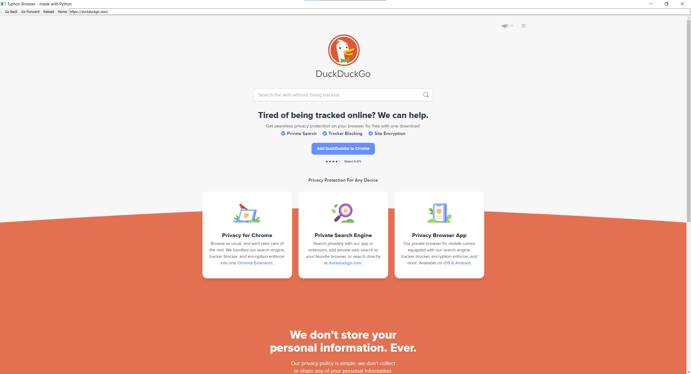

### Simple Python Browser

## Dependencies
  - pip install PyQt5
  - pip install PyQtWebEngine

 

## About this project
This is a simple python browser that I made just for fun and experience with QtWebEngineWidgets.

 
 

# Some Images

 

  

 
 
 

And that's all, thank you 😁
